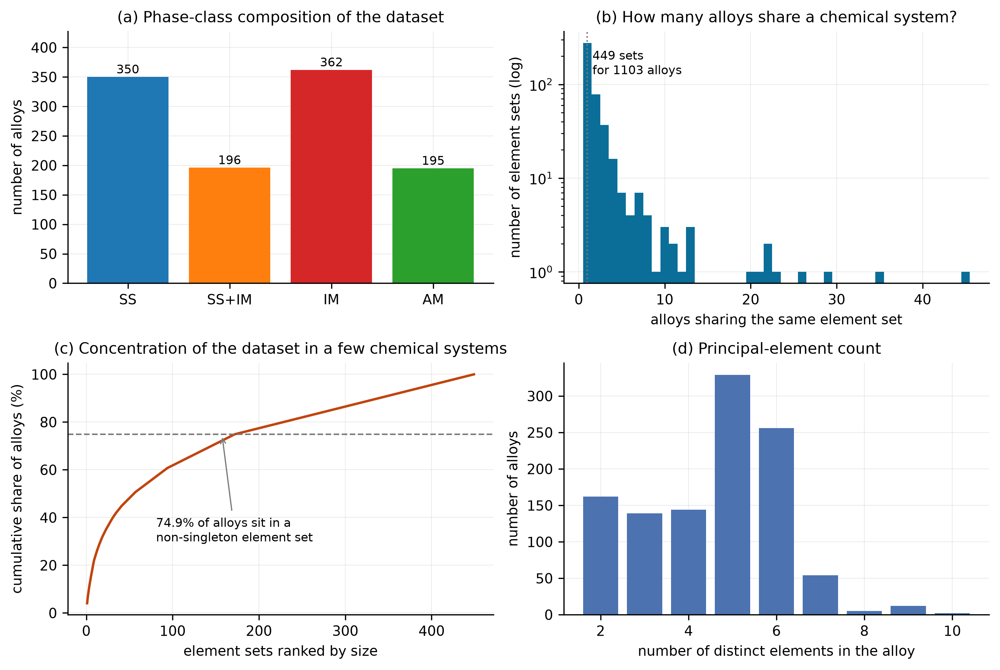
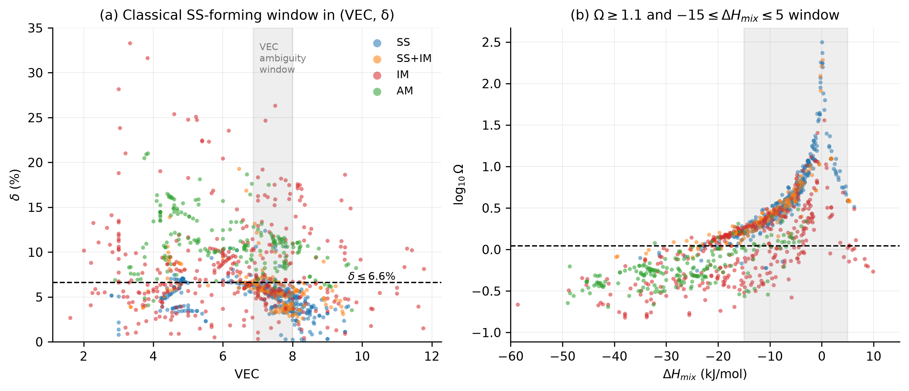
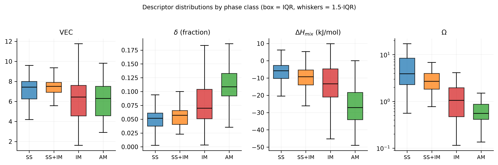
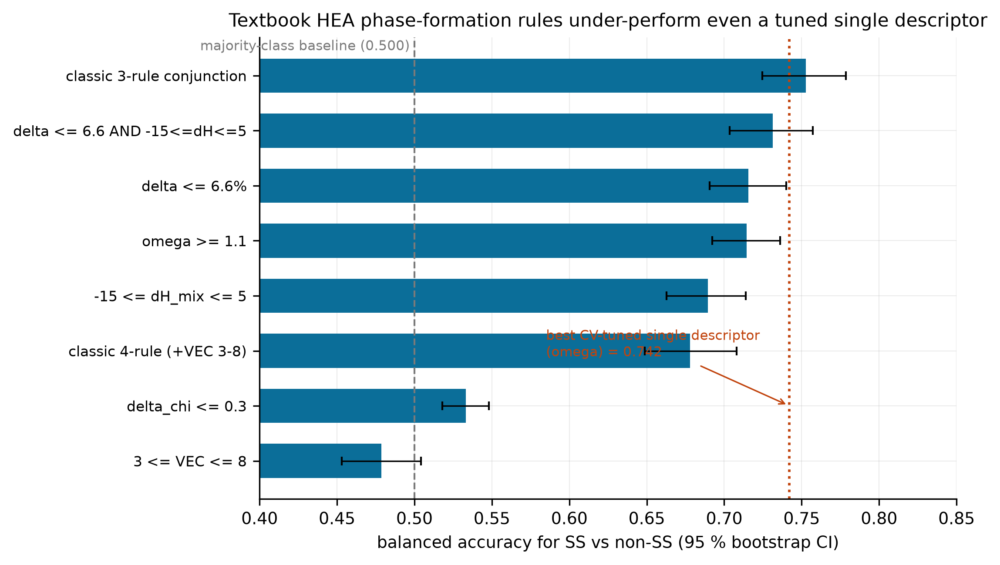
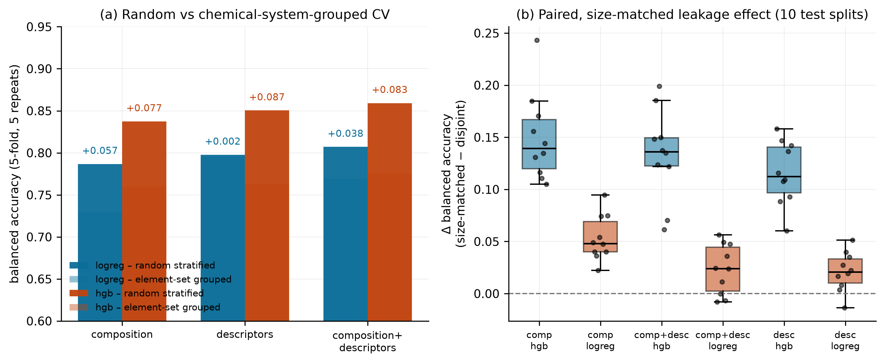
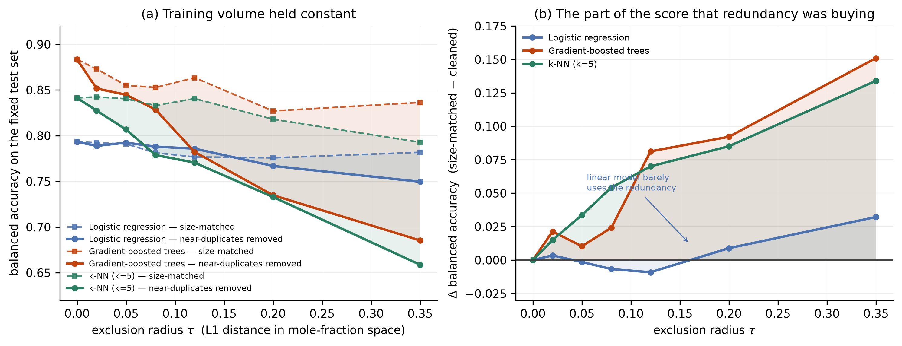
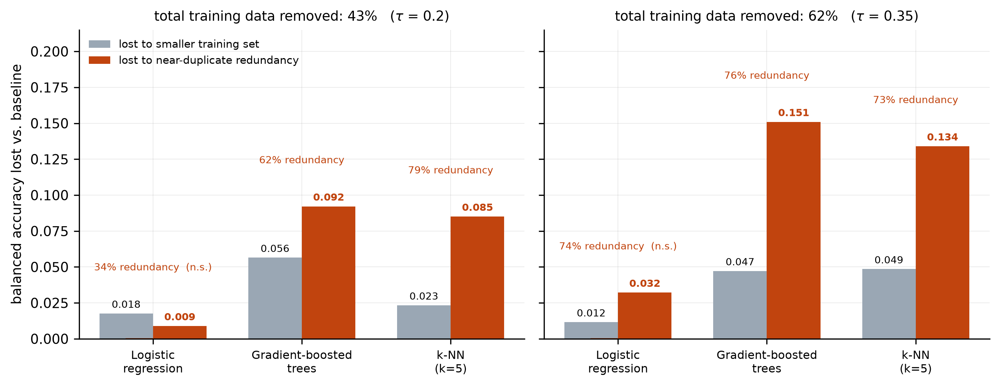
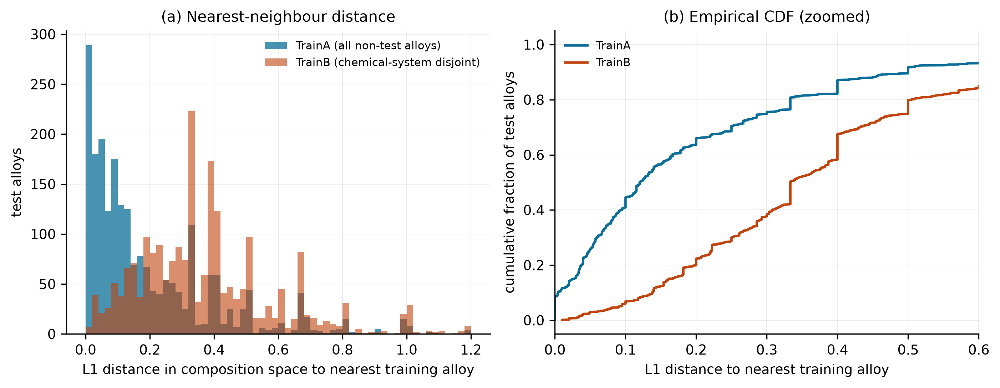
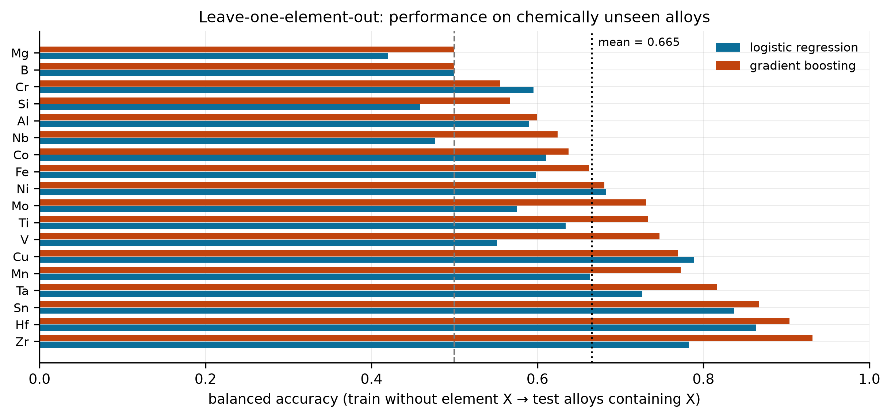

# Redundancy, not skill: separating near-duplicate leakage from training volume in high-entropy-alloy phase prediction

**Author:** [YOUR FULL NAME]<sup>1</sup>
**Affiliation:** <sup>1</sup>[SCHOOL NAME], Beijing, China
**Correspondence:** [YOUR EMAIL]
**Preprint version:** v1, 11 September 2026
**Data:** Zenodo record 6403257 (CC-BY-4.0)
**Code:** [REPOSITORY URL]

---

## Abstract

Machine-learning models for high-entropy-alloy (HEA) phase prediction are routinely reported at 85–95 % accuracy from randomly split data, even though published alloy datasets contain many compositions that differ only in stoichiometry. Removing such redundancy is known to cost accuracy, but the published numbers conflate two things: losing redundant samples and simply having less training data. I separate them.

Using 1,103 experimentally reported alloys (350 solid-solution, 753 not), I first confirm the redundancy is severe: the alloys occupy only 449 distinct element sets, 74.9 % share a chemical system with another record, and 59 compositions are exact duplicates. I then run a size-matched exclusion sweep. For a radius τ in mole-fraction L1 space, I train one model on all training alloys whose distance to the nearest test alloy is at least τ, and a second model on a random subsample of the full pool of identical size. Both see the same number of examples; only the first is free of test-adjacent redundancy.

Gradient-boosted trees lose 0.198 balanced accuracy when 62 % of the training set is removed by this filter. Of that loss, only 0.047 comes from the smaller training set — the remaining **0.151 (76 %) is what redundant, test-adjacent alloys were buying**. A k-NN classifier shows the same pattern (0.134 of 0.183, 73 %), while a regularised logistic regression is essentially unaffected (0.032 of 0.044, not distinguishable from zero). The effect grows monotonically with τ and, importantly, is not driven by strict near-duplicates: excluding only the closest 0.05 L1 shell changes boosted-tree accuracy by 0.010. The inflation lives in the 0.10–0.35 band — same chemical system, nearby stoichiometry. Reported random-split accuracy for high-capacity models on this dataset is therefore overstated by roughly 0.08–0.15 balanced accuracy, and the overstatement tracks model capacity rather than feature choice.

---

## 1. Why this needed doing

A typical HEA machine-learning paper collects compositions and phase labels from the literature, computes empirical descriptors such as δ, ΔH_mix, Ω and VEC, trains a classifier, and reports accuracy on a random test split. Numbers between 0.85 and 0.95 are common.

The problem is that experimental HEA records are not independent draws. Within one chemical system — say Al–Co–Cr–Fe–Ni — the literature contains dozens of alloys that differ only in how much of each element is present. A random split puts some of them in training and some in test. A flexible model can then answer many test questions by recalling a near-identical training alloy, which is memorisation rather than generalisation.

Leakage of this kind is well documented as a general phenomenon, including in a dedicated data-splitting method for the life sciences [6] and in a broad review of leakage in machine-learning-based science [7]. I do not claim to discover it. What I found missing for HEA specifically is a *controlled* number: how much of the reported accuracy is redundancy, how much is just the smaller training set that a stricter split forces on you, and whether the split depends on model capacity. Without that separation, a reader cannot tell whether a reported 0.86 means "the model generalises" or "the model remembered".

Three questions:

- **Q1.** How redundant is a standard open HEA dataset?
- **Q2.** Once redundancy is removed at fixed training size, how much accuracy disappears, and does that depend on model capacity?
- **Q3.** Where in composition space does the effect come from — exact duplicates, or the broader same-system neighbourhood?

---

## 2. Data

Source: *Materials for Design Open Repository. High Entropy Alloys*, Zenodo record 6403257 [1], licence CC-BY-4.0. The raw workbook was downloaded once and never modified.

The label of interest is `S_Phase`, which records the phase constitution as SS (solid solution), SS+IM, IM (intermetallic) or AM (amorphous). Fourteen records carry no label and were dropped, leaving 1,103. The main task is binarised: SS versus everything else. That gives 350 positives and a base rate of 31.7 %, so a model that always answers "not SS" already scores 0.683 raw accuracy. Every result below uses balanced accuracy, which is 0.500 for that trivial baseline.

Features are 78 elemental mole fractions plus nine design descriptors (δ, ΔH_mix, S_id, Ω, VEC, σ_VEC, Δχ, χ, T_m). Ω was recomputed from the Yang & Zhang definition, Ω = T_m ΔS_mix / |ΔH_mix| [3], rather than taken from the spreadsheet.

### 2.1 Redundancy in the dataset



*Figure 1. Redundancy structure. Left: distribution of element-set sizes. Right: how many alloys share a chemical system.*

| Property | Value |
|---|---|
| Labelled alloys | 1,103 |
| Solid-solution (positive class) | 350 (31.7 %) |
| Distinct element sets | 449 |
| Alloys in a shared chemical system | 74.9 % |
| Largest single system | 45 alloys |
| Exact duplicate compositions | 59 |
| Elements appearing at least once | 57 |

The average chemical system holds 2.5 alloys, but the distribution is heavy-tailed: a small number of popular systems (Al–Co–Cr–Fe–Ni and its subsets, refractory Mo–Nb–Ta–V–W, and the Ti–Zr–Hf family) supply a large fraction of the dataset. A random split of such a table is not a random split of chemical space.

---

## 3. Methods

### 3.1 Models

Three model families spanning a wide capacity range:

- **Logistic regression** — median imputation, standardisation, L2 penalty (C = 1), balanced class weights. Low capacity, strongly regularised.
- **Histogram gradient-boosted trees** — 150 iterations, learning rate 0.08, 15 leaves, L2 = 1.0. High capacity.
- **k-NN** — k = 5, distance weighting, cityblock metric on standardised features. Pure instance-based memory; included because if leakage is memorisation, this model should show it most clearly.

### 3.2 Evaluation protocols

1. **Random stratified CV** (5-fold, 3 repeats).
2. **Chemical-system-grouped CV** — `StratifiedGroupKFold` with the element set as the group, so no system spans the split.
3. **Controlled paired experiment** — a fixed 20 % stratified test set. `TrainA_matched` is the full training pool randomly subsampled; `TrainB_disjoint` contains only alloys sharing no element set with any test alloy, subsampled to the same size. Same test set, same training size, 10 splits, Wilcoxon signed-rank test. (The disjoint pool is smaller, retaining 50.6 % of the full pool before matching.)
4. **Near-duplicate exclusion sweep (new, the core of this paper).** Described next.
5. **Leave-one-element-out** — 18 frequent elements; train without element X, test only on alloys containing X.

Metrics are balanced accuracy, MCC and ROC-AUC. Confidence intervals come from 2,000-resample bootstrap over test alloys. All seeds are fixed in the scripts.

### 3.3 The exclusion sweep

Protocols 1–3 tell you *that* redundancy matters but not *how much of the drop is redundancy*. Protocol 4 does.

Fix the test set T. For a radius τ, compute for every training-pool alloy its L1 distance, in mole-fraction space, to the nearest alloy in T. Then build two training sets of identical size n:

- **excluded(τ)** — the alloys with distance ≥ τ. Every test-adjacent neighbour has been physically removed.
- **matched(τ)** — a uniformly random subsample of the *whole* pool, of the same size n. Near-duplicates are still inside, but the training volume is identical.

Train the same model on each and score both on the same T. Define

Δ(τ) = balanced accuracy(matched(τ)) − balanced accuracy(excluded(τ)).

Because the two training sets are the same size, the difference cannot be attributed to data volume. It is the accuracy that test-adjacent redundancy was supplying. Sweeping τ traces how that contribution is distributed across composition space: small τ isolates exact and near-exact duplicates, large τ reaches the whole same-system neighbourhood.

Seven radii were used: τ ∈ {0, 0.02, 0.05, 0.08, 0.12, 0.20, 0.35}, over three splits. At τ = 0 the two sets coincide by construction, which serves as a correctness check.

---

## 4. Results

### 4.1 What the classical criteria are actually worth



*Figure 2. Class overlap inside the classical criterion windows.*



*Figure 3. Descriptor distributions by phase class.*

| Criterion | Balanced accuracy | 95 % CI | Sensitivity | Specificity | MCC |
|---|---|---|---|---|---|
| Always "not SS" | 0.500 | [0.500, 0.500] | 0.000 | 1.000 | 0.000 |
| δ ≤ 6.6 % | 0.716 | [0.690, 0.740] | 0.860 | 0.571 | 0.405 |
| −15 ≤ ΔH_mix ≤ 5 kJ/mol | 0.689 | [0.663, 0.714] | 0.874 | 0.505 | 0.363 |
| Ω ≥ 1.1 | 0.714 | [0.692, 0.736] | 0.943 | 0.486 | 0.419 |
| 3 ≤ VEC ≤ 8 | 0.479 | [0.453, 0.504] | 0.774 | 0.183 | −0.050 |
| Δχ ≤ 0.3 | 0.533 | [0.518, 0.548] | 0.966 | 0.101 | 0.114 |
| δ and ΔH_mix together | 0.731 | [0.704, 0.757] | 0.797 | 0.665 | 0.431 |
| δ + ΔH_mix + Ω (the classical three) | **0.753** | [0.725, 0.779] | 0.786 | 0.720 | 0.474 |
| δ + ΔH_mix + Ω + VEC | 0.678 | [0.649, 0.708] | 0.569 | 0.788 | 0.354 |



*Figure 4. Classical rules against the best achievable single-descriptor threshold.*

The conjunction of δ, ΔH_mix and Ω reaches 0.753, the best of the classical rules. Adding VEC *hurts* (0.678), because the VEC window is a poor discriminator for the SS-versus-not question — it was designed for a different question, which lattice forms.

That distinction matters. Restricting attention to the 220 alloys whose phase is purely FCC or purely BCC, and applying the VEC ≥ 8 → FCC / VEC ≤ 6.87 → BCC rule, leaves 163 decidable cases (74.1 % coverage) and gets **all 163 right**. So "does a solid solution form" and "which lattice does it adopt" are problems of very different difficulty, and VEC answers the second one well while being near-useless for the first.

Threshold-tuned single descriptors set a low ceiling:

| Descriptor | Direction | CV balanced accuracy |
|---|---|---|
| Ω | higher → SS | **0.742 ± 0.029** |
| S_id | higher → SS | 0.730 ± 0.020 |
| δ | lower → SS | 0.728 ± 0.021 |
| ΔH_mix | higher → SS | 0.684 ± 0.025 |
| Δχ | lower → SS | 0.677 ± 0.023 |
| T_m | higher → SS | 0.628 ± 0.024 |
| σ_VEC | lower → SS | 0.609 ± 0.022 |
| VEC | lower → SS | 0.513 ± 0.024 |

Even with the threshold chosen optimally by cross-validation, no single descriptor beats 0.742. The classical three-rule conjunction matches that. **Any machine-learning model claiming 0.90+ on this task is doing something the descriptors cannot do on their own** — which is exactly the situation in which it is worth asking what it is doing.

### 4.2 Random versus grouped cross-validation



*Figure 5. The same model, the same data, two splitting protocols.*

| Features | Model | Random stratified | System-grouped | Difference |
|---|---|---|---|---|
| Composition only | logreg | 0.787 | 0.730 | +0.057 |
| Composition only | hgb | 0.837 | 0.760 | +0.077 |
| 9 descriptors only | logreg | 0.798 | 0.796 | +0.002 |
| 9 descriptors only | hgb | 0.850 | 0.763 | +0.087 |
| Composition + descriptors | logreg | 0.807 | 0.769 | +0.038 |
| Composition + descriptors | hgb | 0.859 | 0.776 | +0.083 |

Two things stand out. The boosted model loses 0.077–0.087 whatever features it is given, including when it sees *only* the nine aggregate descriptors and no composition at all. And the logistic regression barely moves when it sees descriptors only (+0.002) but loses 0.057 on raw composition. Grouping hurts the low-capacity model only when it is handed the input that lets it identify the chemical system directly.

### 4.3 Controlled paired comparison

Fixing the test set and matching training size removes the last confound:

| Features | Model | TrainA_matched | TrainB_disjoint | Δ | 95 % CI | p |
|---|---|---|---|---|---|---|
| Composition only | hgb | 0.787 | 0.638 | **+0.150** | [+0.106, +0.230] | 2.0e-03 |
| Composition + descriptors | hgb | 0.829 | 0.696 | **+0.133** | [+0.063, +0.196] | 2.0e-03 |
| 9 descriptors only | hgb | 0.806 | 0.690 | **+0.116** | [+0.067, +0.155] | 2.0e-03 |
| Composition only | logreg | 0.774 | 0.721 | +0.053 | [+0.025, +0.090] | 2.0e-03 |
| Composition + descriptors | logreg | 0.807 | 0.784 | +0.023 | [−0.008, +0.055] | 2.7e-02 |
| 9 descriptors only | logreg | 0.803 | 0.783 | +0.021 | [−0.010, +0.049] | 9.8e-03 |

For boosted trees, at identical training size and identical test set, chemical-system disjointness alone is worth +0.133 balanced accuracy. For logistic regression the same manipulation is worth +0.023 with a confidence interval that includes zero.

Note that the descriptors-only boosted model still gains +0.116. The nine descriptors are deterministic functions of composition, so this is not evidence that the effect is about features. It says the effect travels with the sample, not with the representation.

### 4.4 Separating redundancy from training volume



*Figure 8. (a) Balanced accuracy on a fixed test set as the exclusion radius grows. Dashed: size-matched control. Solid: near-duplicates removed. (b) The gap between them.*

The paired experiment shows redundancy costs ~0.13, but a critic can still object that the disjoint pool is a different, harder subpopulation. The sweep closes that objection by holding training size exactly constant.

| τ | training size | matched control | near-duplicates removed | Δ |
|---|---|---|---|---|
| 0.00 | 882 | 0.883 | 0.883 | 0.000 |
| 0.02 | 841 | 0.873 | 0.852 | +0.021 |
| 0.05 | 787 | 0.855 | 0.845 | +0.010 |
| 0.08 | 720 | 0.853 | 0.829 | +0.024 |
| 0.12 | 643 | 0.863 | 0.782 | +0.081 |
| 0.20 | 504 | 0.827 | 0.735 | +0.092 |
| 0.35 | 333 | 0.836 | 0.685 | **+0.151** |

*(gradient-boosted trees; means over three splits. The τ = 0 row is the correctness check — the two sets are identical there by construction.)*



*Figure 9. How the total apparent loss splits between a smaller training set and removed redundancy.*

At τ = 0.35, 62 % of the training set has been removed. The matched control, drawn randomly to the same 333 examples, still scores 0.836 — barely below the 0.883 baseline. The cleaned set scores 0.685. So:

| Model | total loss | from smaller training set | from redundancy | redundancy share |
|---|---|---|---|---|
| Gradient-boosted trees | 0.198 | 0.047 | **0.151** | 76 % |
| k-NN (k = 5) | 0.183 | 0.049 | **0.134** | 73 % |
| Logistic regression | 0.044 | 0.012 | 0.032 | 74 % (n.s.) |

For the two high-capacity models, roughly three quarters of the apparent cost of a stricter evaluation protocol is redundancy, not data volume. And the logistic regression result is the control that makes the story coherent: its 0.032 split is smaller than the between-split spread, so a linear model is essentially indifferent to whether near-duplicates are present.

The τ-dependence is the most interesting part, and it is not what I expected going in.

- **Strict near-duplicates contribute almost nothing.** Removing every training alloy within 0.05 L1 of a test alloy — a 11 % cut of the training set, and 25.5 % of test alloys had such a neighbour (Section 4.5) — moves boosted-tree accuracy by 0.010. Deleting the "duplicates" is not where the fix is.
- **The inflation lives in the middle band.** Δ rises from 0.010 at τ = 0.05 to 0.081 at τ = 0.12 and 0.092 at τ = 0.20. The relevant redundancy is not identical compositions but *same chemical system, different stoichiometry* — alloys a model can still memorise a local answer for.
- **It is monotone and capacity-gated.** Δ climbs steadily for boosted trees and k-NN; for logistic regression it oscillates around zero (mean 0.005 across τ ≥ 0.02, maximum 0.032 against a between-split spread of similar size).

### 4.5 Mechanism: nearest-neighbour composition distance



*Figure 6. Distance from each test alloy to its nearest training neighbour.*

| Quantity | TrainA (random) | TrainB (disjoint) |
|---|---|---|
| Median nearest-neighbour distance | 0.120 | 0.333 |
| Share below 0.05 | **25.5 %** | 2.8 % |
| Share below 0.10 | **43.5 %** | 6.5 % |

Under a random split, a quarter of the test set has an almost identical training counterpart and nearly half sits within 0.10. Under the disjoint split those numbers collapse. This is the mechanism behind everything above, and it is why the sweep's middle band (0.10–0.20) is where the accuracy is hiding: that is where the bulk of the test set's neighbours live.

### 4.6 Leave-one-element-out extrapolation



*Figure 7. Balanced accuracy when a single element is held out entirely.*

Holding out one element at a time — training on alloys that do not contain it, testing only on those that do — gives a mean balanced accuracy of **0.665** (sd 0.133, range 0.420–0.931) and mean ROC-AUC 0.776. Against the random-split figure of 0.859, that is a gap of nearly 0.2. The failure modes are chemically legible: Al (0.600) and Si (0.567) are strong intermetallic formers, and Mg (0.500) and B (0.500) have too little data to learn anything. Best extrapolation is to Zr (0.931) and Hf (0.904), which are chemically similar to elements already well represented.

---

## 5. What this means

For this dataset, and for any HEA dataset with the same "one system, many stoichiometries" structure, the practical conclusions are:

1. **A random-split number is not a generalisation estimate.** For high-capacity models the overstatement here is 0.08–0.15 balanced accuracy. That is larger than the difference between most competing model architectures.
2. **Report at least one chemical-system-disjoint split.** It costs one extra line of code (`GroupKFold` with the element set as the group) and it changes the conclusion of a paper more than most hyper-parameter searches do.
3. **Report balanced accuracy and MCC.** With a 31.7 % positive rate, always predicting the majority class scores 0.683 raw accuracy, so raw accuracy flatters every model on this task.
4. **Do not bother de-duplicating exact compositions.** It is the intuitive fix and it recovers almost nothing (0.010). The redundancy that matters is structural, spread across same-system neighbours. A distance-based exclusion at τ ≈ 0.10–0.20, or an element-set split, is what actually bites.
5. **Separate the two questions.** "Can a solid solution form" is hard (ceiling ≈ 0.75 from descriptors). "FCC or BCC" is easy (100 % on the decidable subset). Reporting them together hides both facts.
6. **Use leave-one-element extrapolation as a stress test.** It is cheap and it exposes which elements the model has genuinely learned versus memorised.

The measurement protocol transfers. Any dataset where records cluster into families — materials, bioactivity series, clinical cohorts from the same site — can be run through the same sweep: fix the test set, vary an exclusion radius, and report how much of the headline number survives at matched training size.

---

## 6. Limitations

- **One dataset.** The magnitudes are specific to this table. The direction and the capacity dependence should transfer; the exact 0.151 should not be quoted as a universal constant.
- **Label noise.** Labels come from aggregating literature; processing route and thermal history are not recorded. SS+IM is inherently an intermediate category and probably the largest source of irreducible error.
- **Grouping is approximate.** "Same element set" is a coarse proxy for "same chemical family", and the exclusion sweep uses raw composition distance, which ignores chemistry. Stricter grouping would give a *larger* effect, so the numbers here are lower bounds.
- **Three model families, no capacity sweep.** I did not tune hyper-parameters, deliberately, to keep protocols comparable. A proper capacity sweep (varying tree depth or regularisation strength along a continuum) would show where the transition from "indifferent" to "exploiting" happens.
- **Three splits in the sweep.** The paired Δ at τ = 0.35 is well outside the between-split spread, but the intermediate radii (τ = 0.05–0.08) are not individually resolved. The monotone trend is the claim; individual small values are not.
- **No external validation.** Nothing here was checked against new experiments; the study is entirely a re-analysis of published data.

---

## 7. Reproducibility

```
research/
├── data/     raw workbook (read-only) + cleaned parquet/csv
├── code/     hea_common.py, 00_profile.py, 01_build_dataset.py,
│             02_criteria_audit.py, 03_leakage_experiment.py,
│             04_figures.py, 05_report.py, 06_report_en.py,
│             07_exclusion_sweep.py, 08_paper_figures.py
├── out/      result JSON/CSV, all numbers quoted above
├── figures/  9 figures at 300 dpi
└── report/   full HTML and Markdown reports (Chinese and English)
```

```
cd research/code
python 00_profile.py && python 01_build_dataset.py && python 02_criteria_audit.py
python 03_leakage_experiment.py stage1
python 03_leakage_experiment.py stage2
python 03_leakage_experiment.py merge
python 07_exclusion_sweep.py run
python 07_exclusion_sweep.py merge
python 04_figures.py && python 08_paper_figures.py
```

Python 3.13 with numpy, pandas, scipy, scikit-learn, matplotlib, openpyxl, pyarrow. Every seed is fixed in the scripts. Every number in this manuscript was read at build time from the files under `out/`; none was transcribed by hand.

---

## Declarations

**Use of AI tools.** This study was carried out with substantial assistance from an AI system, which ran the analysis pipeline, produced the figures and drafted the text. The AI did not generate any data. All data are third-party published measurements. The author specified the research question, reviewed the analysis, and takes responsibility for the content, including any errors. This disclosure is provided in line with current publisher policies on AI-assisted research; readers should weigh the results accordingly.

**Data availability.** Zenodo record 6403257, DOI 10.5281/zenodo.6403257, CC-BY-4.0. The dataset was not modified.

**Code availability.** [REPOSITORY URL — to be filled in before submission.]

**Competing interests.** None.

**Funding.** None.

---

## References

1. Precker, C. E., Gregores Coto, A. & Muíños Landín, S. *Materials for Design Open Repository. High Entropy Alloys*. Zenodo (2021). DOI 10.5281/zenodo.6403257. CC-BY-4.0. (data source)
2. Zhang, Y., Zhou, Y. J., Lin, J. P., Chen, G. L. & Liaw, P. K. Solid-solution phase formation rules for multi-component alloys. *Advanced Engineering Materials* **10**, 534–538 (2008). (δ criterion)
3. Yang, X. & Zhang, Y. Prediction of high-entropy stabilized solid-solution in multi-component alloys. *Materials Chemistry and Physics* **132**, 233–238 (2012). (Ω criterion)
4. Guo, S. & Liu, C. T. Phase stability in high entropy alloys: formation of solid-solution phase or amorphous phase. *Progress in Natural Science: Materials International* **21**, 433–446 (2011). (VEC criterion)
5. Guo, S., Ng, C., Lu, J. & Liu, C. T. Effect of valence electron concentration on stability of fcc or bcc phase in high entropy alloys. *Journal of Applied Physics* **109**, 103505 (2011). (VEC ≥ 8 → FCC)
6. Joachimiak, M. P., Nielsen, J. S. & Winther, O. Data splitting to avoid information leakage with DataSAIL. *Nature Communications* **16** (2025).
7. Kapoor, S. & Narayanan, A. Leakage and the reproducibility crisis in machine-learning-based science. *Patterns* **4**, 100804 (2023).

---

*The dataset belongs to its original authors; nothing in this manuscript is a criticism of any specific published work. The claim is narrow: on this dataset, under this protocol, this much of the reported accuracy is redundancy.*
